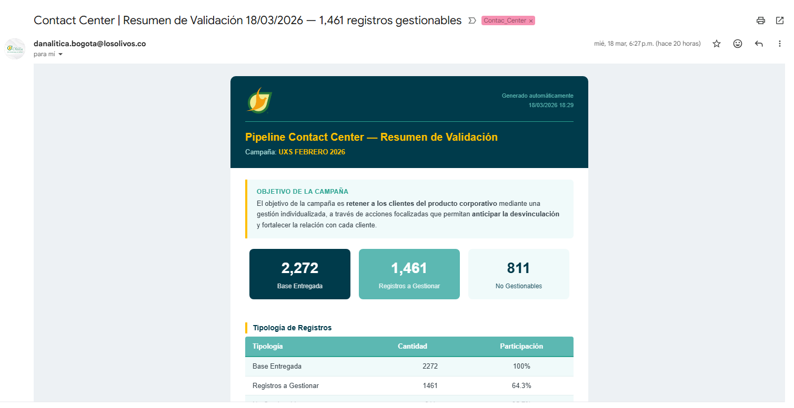
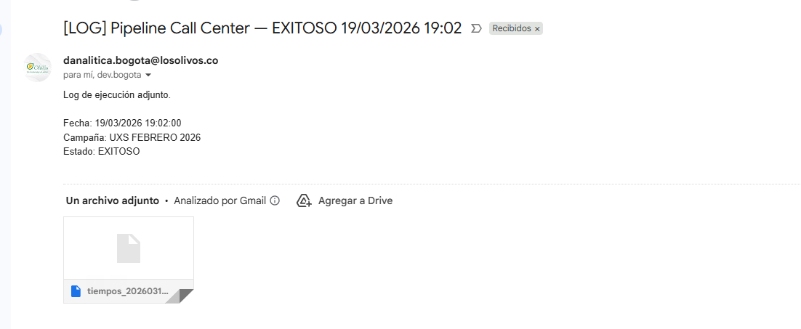

<div align="center">


# Proyecto automatización Contact Center — Los Olivos


**Área:** Dirección de Tecnología | Dirección de Analítica — Los Olivos
**Plataforma de marcación:** Wolkvox | **Lenguaje:** Python 3.x | **Actualización:** Marzo 2026

</div>

---
## Video Instructivo

[](https://drive.google.com/file/d/1mWzBQb-fU5a4I5WwuYG2aTUHIt1R9Z_O/view?usp=sharing)

## Descripción

Pipeline automatizado que extrae, valida y carga la base de clientes retirados de la compañía hacia la plataforma de Contact Center Wolkvox. Identifica clientes potencialmente reactivables para la campaña mensual de la UXS (Unidos por Siempre), crea la campaña automáticamente en Wolkvox y envía un resumen operativo al equipo por correo electrónico.

**Objetivo de la campaña:** Reactivar clientes del producto corporativo que ya han finalizado su relación con la compañía, mediante estrategias de contacto individualizado orientadas a su reincorporación.

---

## Arquitectura

```
[CSV Retiros]     [API Contratos]     [CSV P&G]     [API Gerencia]
      │                  │                │                │
      └──────────────────┴────────────────┴────────────────┘
                                  │
                           CARGA DE DATOS
                                  │
                    ENRIQUECIMIENTO Y REGLAS DE NEGOCIO
                    (antigüedad · convenio · plazo · P&G)
                                  │
                      NORMALIZACIÓN DE CONTACTOS
                    (correos · celulares · teléfonos fijos)
                                  │
                        FILTRO DE GESTIONABLES
               antigüedad > 6m  ·  celular válido  ·  edad > 20
                                  │
               ┌──────────────────┴──────────────────┐
          base_final.csv                    Correo HTML resumen
                                  │
                        CREAR CAMPAÑA Wolkvox
                                  │
                       CARGAR REGISTROS (lotes 100)
```

---

## Flujo de Ejecución

### Paso 1 — Autenticación API interna
`POST /api/Login` → obtiene `Bearer Token`. Si falla, el pipeline se detiene.

### Paso 2 — Carga de datos

| Fuente | Tipo | Origen |
|---|---|---|
| Retiros | CSV | `Y:\Retiros\Retiros_*.csv` (más reciente) |
| Contratos | API POST | `/api/ContratosAnalitica` |
| P&G | CSV | `Y:\Retiros\Consolidado.csv` (más reciente) |
| Gerencia | API GET | `/api/Gerencia` |

### Paso 3 — Enriquecimiento y Reglas de Negocio

1. **Merge con Contratos** — asocia NIT de entidad por número de contrato.
2. **Merge con P&G** — incorpora `EXCEDENTE_NETOC` por NIT.
3. **Antigüedad y reglas:**
   - `Antigüedad Meses` = días entre `Fecha_Extraccion` y `Fecha Afiliación` / 30
   - `Plazo`: "Financiado" si excedente > 0 · "Hasta 6 Meses" si excedente ≤ 0
   - `Anual`: "Anual" si edad > 65
4. **Convenio** — contratos en Gerencia se marcan como "No gestionar".

### Paso 4 — Normalización de Contactos

**Correos:** extrae y descarta correos genéricos (dominios propios masivos, proveedores personales `@gmail/@hotmail`, prefijos de rol `info/ventas/admin`, frecuencia ≥ 15 en la base).

**Celulares:** válido si tiene 10 dígitos, empieza por `3` y el prefijo está en operadores colombianos (`300`–`324`, `333`, `350`, `351`). Captura hasta dos por registro.

**Teléfonos fijos:** válido si tiene 10 dígitos, empieza por `60` y el código de área es `601/602/604/605/606/607/608`. Descarta placeholders (`1111111111`, `3000000000`).

### Paso 5 — Filtro de Gestionables

```
¿Antigüedad > 6 meses?  ──NO──→  No gestionar
        │ SÍ
¿Tiene celular válido?  ──NO──→  No gestionar
        │ SÍ
¿Edad > 20 años?        ──NO──→  No gestionar
        │ SÍ
   GESTIONABLE ✅
```

**Mapeo de columnas hacia Wolkvox:**

| Campo Wolkvox | Fuente | Descripción |
|---|---|---|
| `NOMBRE` / `APELLIDO` | `Titular` | Nombre del cliente |
| `ID` | `Identificación` | Cédula sin prefijo "C" |
| `OPT1` | `Contrato` | Número de contrato |
| `OPT2` | `Entidad` | Nombre de la entidad |
| `OPT3` | `Producto` | Tipo de producto |
| `OPT4` | `Plazo` | Plazo de pago calculado |
| `OPT5` | `OPT5_CAMPANA` | Nombre campaña (`UXS FEBRERO 2026`) |
| `OPT12` | `Celular_actualizado` | Celular validado |
| `TEL1` | `Telefono_actualizado` | Fijo (si no hay, usa `96` + celular) |
| `TEL2` | `Celular_actualizado` | Celular |
| `EMAIL` | `Correo_Actualizado` | Correo validado |

### Paso 6 — Exportar CSV
Genera `base_final.csv` en `utf-8-sig` (compatible con Excel).

### Paso 7 — Carga a Wolkvox

**7a. Crear campaña** → `POST ?api=create_campaign&type_campaign=preview`

### Paso 8 — Correos de notificación

Se envían **dos correos independientes** al finalizar la ejecución:

| Correo | Destinatario | Contenido |
|--------|-------------|-----------|
| Resumen HTML | `EMAIL_DESTINO` | Tablas de validación por categoría + logo institucional |
| Log de ejecución | `EMAIL_LOG` | Tiempos por paso adjunto como `.log` |



Si el pipeline **falla**, se envía a `EMAIL_LOG` un correo `[ALERTA]` con el traceback completo y el log parcial adjunto.



---

## Entidades Excluidas

| Entidad |
|---|
| COMERCIALIZADORA DE SERVICIOS BASICOS SAS |
| COOPERATIVA DE EMPLEADOS DE CAFAM |
| FONDO DE EMPLEADOS DE DAVIVIENDA - FONDAVIVIENDA |
| COOPERATIVA DE LOS PROFESIONALES COASMEDAS - COASMEDAS |

---

## Configuración

Variables a definir en `pipeline_call_center.py`:

| Variable | Descripción |
|---|---|
| `API_BASE_URL` | URL servidor API interna |
| `API_USER` / `API_PASSWORD` | Credenciales API interna |
| `WV_SERVER` | Servidor Wolkvox (`wv0039`) |
| `WV_TOKEN` | Token Wolkvox Manager |
| `WV_SKILL_ID` | ID del skill (`4111`) |
| `WV_CAMPAIGN_TYPE` | Tipo de campaña (`preview`) |
| `WV_HORA_INICIO` / `WV_HORA_FIN` | Horario de marcación |
| `WV_BATCH_SIZE` | Registros por lote (máx `100`) |
| `SMTP_USER` / `SMTP_PASSWORD` | Cuenta Gmail y contraseña de aplicación |
| `EMAIL_DESTINO` | Lista de destinatarios del resumen HTML |
| `EMAIL_COPIA` | Lista de destinatarios en copia del resumen HTML |
| `EMAIL_LOG` | Lista de destinatarios del log de ejecución y alertas de error |
| `RETIROS_DIR` | Carpeta retiros (`Y:\Retiros`) |
| `CONSOLIDADO_PATH` | Ruta CSV de P&G |

---

## Instalación

```bash
pip install pandas numpy requests urllib3 openpyxl
```

---

## Ejecución

**Manual:**
```powershell
cd "C:\...\Call_center_automatisation"
python pipeline_call_center.py
```

**Automática:** configurar `ejecutar_pipeline.bat` en el Programador de Tareas de Windows para el primer día hábil de cada mes.

**Probar Wolkvox antes de ejecutar:**
```powershell
python test_wolkvox_carga.py
```

**Probar correo antes de ejecutar:**
```powershell
python test_correo.py
```

---

## Estructura del Repositorio

```
Call_center_automatisation/
├── pipeline_call_center.py   # Script principal
├── ejecutar_pipeline.bat     # Lanzador Task Scheduler
├── test_wolkvox_carga.py     # Prueba API Wolkvox
├── test_correo.py            # Prueba SMTP
├── .env.example              # Referencia de variables de entorno
├── .gitignore
├── imagenes/                 # Imágenes del proyecto
│   ├── LogoOlivos_2.png      # Logo para correo HTML
│   ├── Envios_correo.PNG     # Captura correo de resumen
│   └── Log.png               # Captura correo de alerta/log
├── historico/                # CSVs base_final por ejecución (gitignored)
└── logs/                     # Logs de tiempos por ejecución (gitignored)
```

---

## Logs y Monitoreo

Cada ejecución genera `logs/tiempos_YYYYMMDD_HHMM.log` con tiempos por paso y total.

```
  1. Autenticación API                        0.2 seg    0.1%
  2. Carga de datos (API + CSVs)            258.1 seg   98.3%  ███████████████████
  3. Enriquecimiento y reglas                 1.5 seg    0.6%
  4. Normalización de contactos               0.5 seg    0.2%
  5. Filtrado + base_final                    0.0 seg    0.0%
  6. Exportar CSV                             0.1 seg    0.0%
  7. Envío de correo                          2.0 seg    0.8%
  8. Carga a Wolkvox                         XX.X seg    X.X%
  ──────────────────────────────────────────────────────────
  TOTAL                                     262.6 seg  (4.4 min)
```

---

## Dependencias

| Librería | Uso |
|---|---|
| `pandas` | Manipulación de DataFrames |
| `numpy` | Operaciones vectorizadas y condicionales |
| `requests` | Llamadas a APIs REST |
| `urllib3` | Supresión de warnings SSL |
| `smtplib` | Envío de correo SMTP |
| `re` / `pathlib` / `datetime` | Normalización, rutas y fechas |

---

## Problemas Conocidos

| Situación | Comportamiento |
|---|---|
| API interna sin respuesta | Pipeline se detiene en paso 1 con `RuntimeError` |
| Sin archivos `Retiros_*.csv` | Lanza `FileNotFoundError` |
| Wolkvox retorna `code` como string | Se compara con `str(code) in ["200","201"]` |
| Correo sin logo | Se envía igual con texto alternativo |
| SSL autofirmado en API interna | `urllib3.disable_warnings` suprime los warnings |

---

## Autor

**Dirección de Analítica — Los Olivos**
`analitica@empresa.co`
